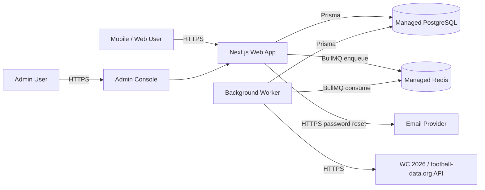
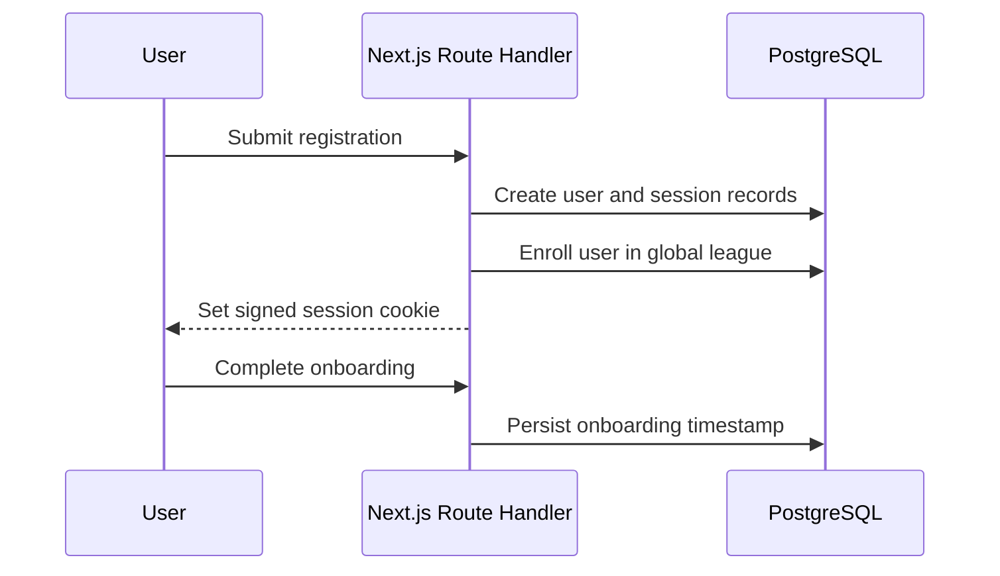
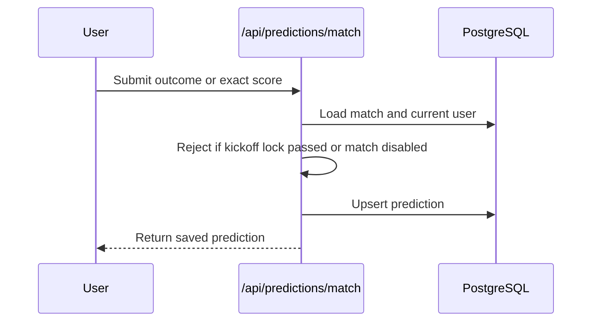
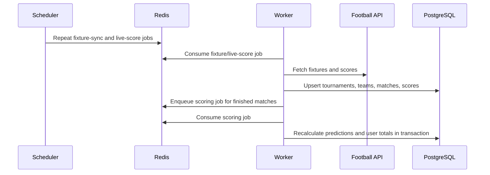
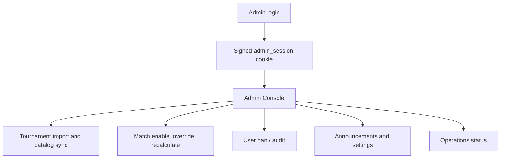
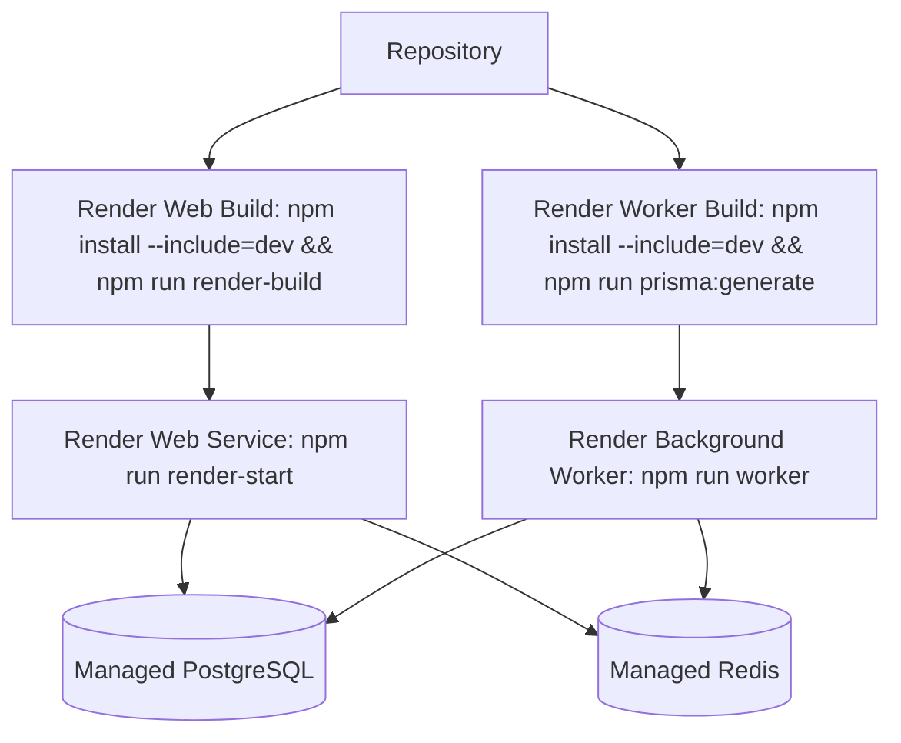

# Application Design Blueprint Architecture

This blueprint describes the production-oriented architecture for **Football Fantasy Myanmar - WC 2026**, a Next.js application for World Cup predictions, private leagues, live fixture ingestion, and event-driven scoring.

## 1. Architecture goals

- **Mobile-first fantasy experience:** keep the primary user journey focused on registration, onboarding, predictions, daily shares, leagues, history, and winner/leaderboard screens.
- **Operationally simple deployment:** run as standard Node.js services without Docker: one web service for the Next.js application and one background worker service for BullMQ jobs.
- **Authoritative scoring:** persist predictions before kickoff, ingest official match results, and calculate points through server-side scoring services only.
- **Tournament-data flexibility:** support a preferred WC 2026 data provider while retaining a football-data.org-compatible fallback.
- **Admin-controlled operations:** expose admin tools for tournaments, fixtures, announcements, users, settings, scoring overrides, recalculation, and operational job status.

## 2. System context



## 3. Runtime topology

| Runtime | Responsibility | Entry points | Scaling notes |
| --- | --- | --- | --- |
| Web service | Serves React UI, Next.js route handlers, session-protected user APIs, admin APIs, and generated app assets. | `npm run dev:web`, `npm run build`, `npm run render-start` | Scale horizontally behind the hosting provider. Keep server code stateless; session identity lives in signed cookies and persistent session rows. |
| Background worker | Runs BullMQ workers for fixture sync, live-score polling, and scoring queues. | `npm run worker`, `npm run dev:worker` | Scale independently from web. Scoring queue supports higher concurrency than live-score polling. |
| Scheduler | Registers recurring BullMQ jobs when a one-off scheduler process is preferred. | `npm run scheduler` | Run during deploys or as a scheduled maintenance command when recurring jobs need explicit registration. |
| PostgreSQL | Stores accounts, sessions, tournaments, teams, players, matches, predictions, leagues, announcements, settings, and job status. | `DATABASE_URL` | Use managed backups, migration history, and connection limits appropriate for Prisma. |
| Redis | BullMQ queue backend for ingestion and scoring jobs. | `REDIS_URL` | Use TLS in production and monitor queue depth, retries, and dead-letter behavior. |

## 4. Codebase layer map

```text
src/app/                  Next.js App Router pages and route handlers
src/components/           Reusable UI components and application shell
src/lib/                  Shared server/frontend helpers, auth, Prisma, config, leagues, daily cards
src/services/             Domain services for football APIs, fixture ingestion, scoring, outrights
src/jobs/                 BullMQ queues, workers, scheduler, and job processors
src/store/                Client-side app state
prisma/schema.prisma      Relational schema and Prisma model definitions
prisma/migrations/        Database migration history
public/                   PWA manifest, service worker, static logo assets
tests/                    Node test runner unit tests for scoring and country flags
```

## 5. Module boundaries

### Presentation and client state

- App Router pages under `src/app/(main)` implement the authenticated user experiences: dashboard, prediction flow, daily share, leagues, history, and winners.
- Public auth pages under `src/app` handle sign-up, onboarding, password reset, and forgot-password flows.
- Admin pages under `src/app/admin` and `src/app/admin-console` provide privileged operational controls.
- Shared components in `src/components` encapsulate navigation, cards, profile controls, gates, prediction forms, announcement popups, and PWA registration.
- Client state is centralized in `src/store/useStore.tsx` for cross-page UI state that should not live in the database.

### API and server-side application layer

- User APIs live under `src/app/api` and are grouped by domain: auth, predictions, matches, tournaments, leagues, announcements, settings, and password reset.
- Admin APIs live under `src/app/api/admin` and enforce admin session checks before mutating tournaments, matches, predictions, settings, users, announcements, leagues, or operational controls.
- Route handlers should stay thin: validate input, require the appropriate user/admin identity, call domain services or Prisma queries, and return normalized JSON errors.

### Domain services

- `src/services/footballApi.ts` normalizes external competition, fixture, team, squad, and player provider payloads into internal DTOs.
- `src/services/fixtures.ts` upserts fixtures, teams, and match results, then queues scoring jobs when a finished match has a standard-time score.
- `src/services/scoring.ts` recalculates match prediction points and user aggregate totals inside a transaction.
- `src/services/outrightCatalog.ts` loads live tournament teams and players for outright picks.
- `src/services/outrightSettlement.ts` settles tournament-level outright awards after final results are known.

### Infrastructure helpers

- `src/lib/prisma.ts` owns the singleton Prisma Client and database compatibility helpers.
- `src/lib/config.ts` centralizes environment-driven configuration such as JWT secrets, provider URLs, tournament lock times, Redis URL normalization, and email settings.
- `src/lib/auth.ts` and `src/lib/adminAuth.ts` own signed-cookie session creation, identity lookup, and guard helpers.
- `src/jobs/queues.ts` owns Redis connections and BullMQ queue construction.

## 6. Core data model

| Aggregate | Prisma models | Purpose |
| --- | --- | --- |
| Identity and access | `User`, `AdminAccount`, `OAuthAccount`, `UserSession`, `PasswordResetToken` | User registration, signed sessions, admin login, OAuth account linkage, password reset. |
| Tournament catalog | `Tournament`, `Team`, `Player`, `Match` | Competition metadata, participants, player catalogs, and match schedule/results. |
| Predictions and scoring | `Prediction`, `Outright`, `OutrightSettlement` | Match predictions, tournament award picks, scored results, and outright settlements. |
| Leagues and rankings | `League`, `LeagueMember`, `LeagueRankSnapshot` | Global/private league membership, leaderboard views, and historical rank snapshots. |
| Engagement | `ShareCard`, `ShareCardItem`, `Announcement`, `AnnouncementView` | Daily prediction sharing and admin-managed announcements. |
| Notifications and operations | `NotificationPreference`, `NotificationDelivery`, `AppSetting`, `AdminJobStatus` | User notification targets, delivery records, maintenance settings, and job run status. |

## 7. Request and job flows

### 7.1 User registration and onboarding



Design notes:

- Registration should remain idempotent around global league enrollment.
- Banned users must be blocked by session lookup before protected data is returned.
- Onboarding gates should rely on persisted user state, not local-only browser state.

### 7.2 Match prediction submission



Design notes:

- The server is the source of truth for lock checks; the UI countdown is advisory only.
- Prediction updates should preserve audit-friendly timestamps through `submittedAt` and `updatedAt`.
- Disabled matches should not accept user predictions even if they remain visible for context.

### 7.3 Fixture ingestion and scoring



Design notes:

- Fixture ingestion must be safe to rerun because external providers can correct kickoff times, venues, statuses, and scores.
- Scoring jobs should be idempotent: recalculating a match should converge to the same prediction and user totals.
- Standard-time scores are used for point calculation when knockout matches include extra-time or penalty outcomes.

### 7.4 Admin operations



Design notes:

- Admin and user sessions use separate cookie names and scopes.
- Super-admin-only operations should be explicitly guarded in route handlers.
- Operational endpoints should update `AdminJobStatus` so failures are visible from the console.

## 8. API surface inventory

| Domain | Representative routes | Responsibilities |
| --- | --- | --- |
| Auth | `/api/auth/register`, `/api/auth/login`, `/api/auth/logout`, `/api/auth/me`, `/api/auth/forgot-password`, `/api/auth/reset-password` | User identity, session lifecycle, password reset. |
| Predictions | `/api/predictions/match`, `/api/predictions/outrights` | Match and tournament-level prediction persistence. |
| Fixtures and tournaments | `/api/matches`, `/api/tournaments` | Public fixture, score, and tournament catalog reads. |
| Leagues | `/api/leagues/create`, `/api/leagues/join`, `/api/leagues/[id]/leaderboard` | Private league creation, membership, and leaderboards. |
| Announcements and settings | `/api/announcements/active`, `/api/announcements/[id]/seen`, `/api/settings/public` | User-facing announcements and public app configuration. |
| Admin auth | `/api/admin/auth/login`, `/api/admin/auth/logout`, `/api/admin/auth/me` | Admin session lifecycle. |
| Admin operations | `/api/admin/*` | Tournament import, match sync/override/recalculate, prediction review, user controls, announcements, settings, and job status. |

## 9. Security architecture

- **Authentication:** signed JWT cookies identify users and admin accounts. Admin cookies include an explicit `scope` claim.
- **Authorization:** route handlers must call `requireUser`, `requireAdminAccount`, or `requireSuperAdminAccount` before protected operations.
- **Password storage:** bcrypt hashes are used for password-backed accounts.
- **Session cookies:** production cookies should be HTTP-only, `sameSite=lax`, and `secure` when served over HTTPS.
- **Secrets:** production must set strong `NEXTAUTH_SECRET`/`JWT_SECRET`, database credentials, Redis credentials, football API keys, and email provider keys through environment variables.
- **Administrative defaults:** replace or disable any bootstrap default admin credentials before a public launch.
- **Data integrity:** use Prisma migrations for production schema changes and keep scoring mutations transactional.

## 10. Deployment architecture



Recommended production checklist:

1. Provision managed PostgreSQL and Redis.
2. Configure all web and worker environment variables from the same secret source.
3. Run `npx prisma migrate deploy` before or during release promotion.
4. Start the web service and background worker as independent services.
5. Register recurring jobs with the worker startup path or the scheduler command.
6. Monitor web errors, worker process health, queue depth, failed jobs, database latency, and external provider failures.

## 11. Quality gates

- `npm run typecheck` verifies TypeScript across route handlers, services, jobs, components, and tests.
- `npm test` runs the Node test suite for deterministic domain helpers such as scoring and country flags.
- `npm run build` validates the production Next.js bundle and should be part of release qualification.
- Database changes should include Prisma migration files and a migration rollback/forward plan.

## 12. Future architecture considerations

- Add queue dashboards or structured worker telemetry for failed fixture/scoring jobs.
- Introduce database-level audit tables for high-risk admin operations such as score overrides and user bans.
- Move email delivery behind a durable notification job if password reset and announcement notifications expand.
- Add rate limiting for auth, password reset, prediction submission, and admin login endpoints.
- Add integration tests for route handlers using a disposable PostgreSQL database when CI infrastructure is available.
